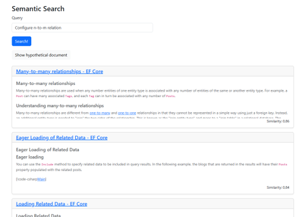

# PoC Demo HyDE with Phi-3 in C#

> The code in this repository is not production ready but demonstrates the concepts.

This repository contains a simple semantic search Blazor application leveraging [Hypothetical Document Embeddings](https://arxiv.org/abs/2212.10496). Slides (german) [are available too](slides.pdf).

* Assumes a working CUDA/cuDNN installation
* Assumes models can be downloaded to `D:\hf` and below (subfolders will be created)
* Assumes corpus embedding vectors can be saved to files inside `D:\docs`
* Assumes some repos to be available:
  * <https://github.com/dotnet/docs> at `D:\docs\dotnet-docs`
  * <https://github.com/dotnet/AspNetCore.Docs> at `D:\docs\aspnetcore`
  * <https://github.com/dotnet/EntityFramework.Docs> at `D:\docs\ef`
  * <https://github.com/npgsql/doc> at `D:\docs\npgsql`
* `CorpusEmbedder`'s progress reporting is partly broken but that does not affect it's main purpose
